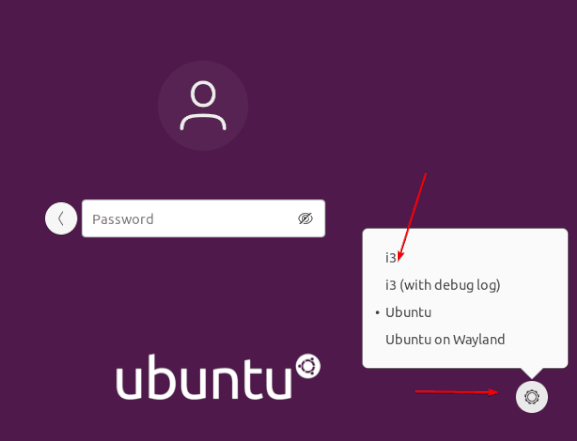
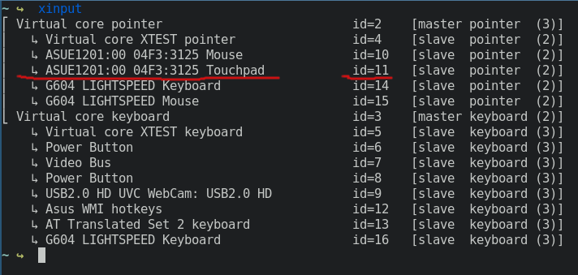
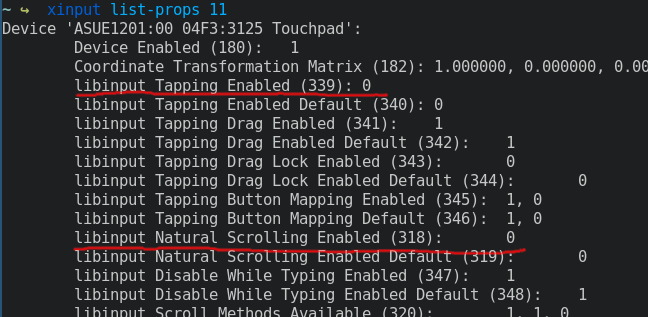
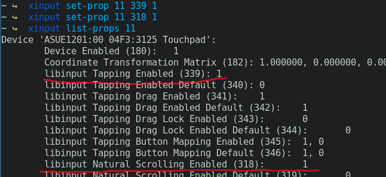

## I3 Window Manager
installation as simple as run:
`sudo apt install i3`
then, logout, and in the login menu search for a little gear icon, to select i3



#### table of contents
- [wallpaper](#wallpaper)
- [touchpad](#touchpad)
- [screenshots](#screenshots)


# Wallpaper
- install FEH ```sudo apt install feh```
- and include the next line i
n `~/.congig/i3/config`
  - `exec --no-startup-id feh --bg-fill ~/Pictures/Wallpapers/hasbullah.jpg`

# TouchPad
to change some functionalites of the touchpad fist run `xinput` and you will se a list of devices, remember the id of the touchpad



then run `xinput list-props ID` or `xinput list-props 11` *in my case*



for example i want to enable **tap to click** so i have to run 
`xinput set-prop 11 399 1`
this will set the property **399** *Tapping* to **1** or *true*

and also i want to enable *Natrual Scrolling* to invert the scrolling direction of the touchpad
`xinput set-prop 11 318 1`



and finaly set the comands to run from i3 startup
```bash
#MOUSE CONFIG
exec --no-startup-id xinput set-prop 11 339 1
exec --no-startup-id xinput set-prop 11 318 1
```


# Screenshots
the preinstalled tool `ìmport` is simple and works well for me
you only need to pass a parameter, the picture path and file name
example: `import ~/Pictures/screenshots/capture.png`
acually you can go a bit more fancy and use:
- **BY DATE**
`import ~/Pictures/screenshots/capture_$(date '+%H_%M_%S-%d_%m_%y').png`\
will output a file **capture_23_41_33-29_07_22.png** based on time and date
- **BY COUNT**
`import ~/Pictures/screenshots/capture_$(ls ~/Pictures/screenshots | wc -l).png`\
will otput a file **capture_0.png**, **capture_1.png** ... but this may have errors\
if you have capture_0 and capture_1, and now you delete caopure_0, then the comand `ls | wc -l` will output 1, but capture_1 already exists, so it will be overwriten over and over.

**Configuration for i3**
you can **bindsym** with `$mod+Shift+p` or simply `Print` will use ImpPant button
```bash
#SCREENSHOT CROP
bindsym $mod+Shift+p --release exec import ~/Pictures/screenshots/capture_$(date '+%H_%M_%S-%d_%m_%y').png
```
or as i did, the last capture will be overwitten in `screenshots/last.png`an then copied to its save format with date
```bash
bindsym Print --release exec import ~/Pictures/screenshots/last.png && cp ~/Pictures/screenshots/last.png ~Pictures/screenshots/capture_$(date '+%H_%M_%S-%d_%m_%y').png
```

